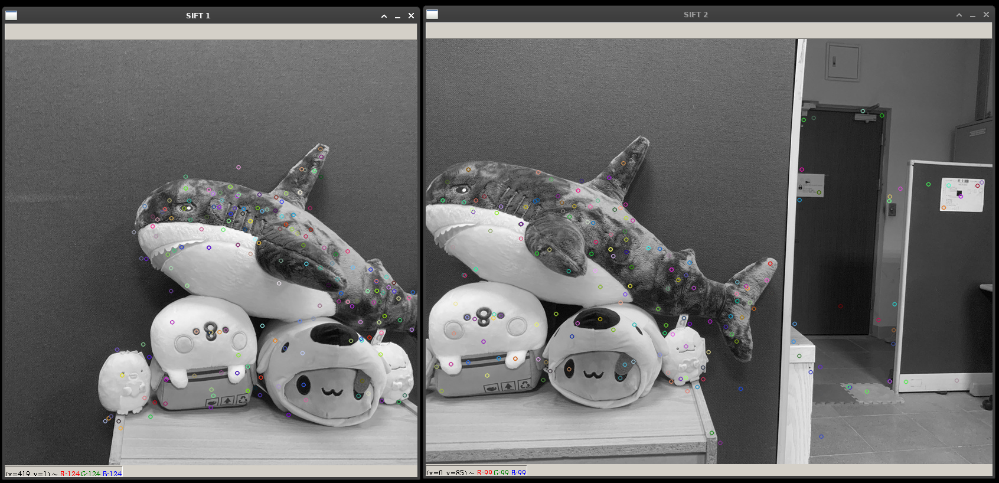
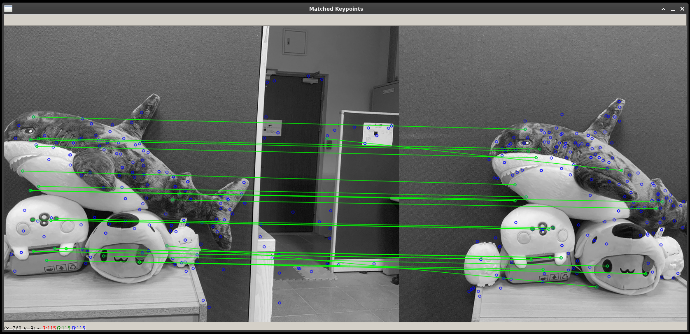
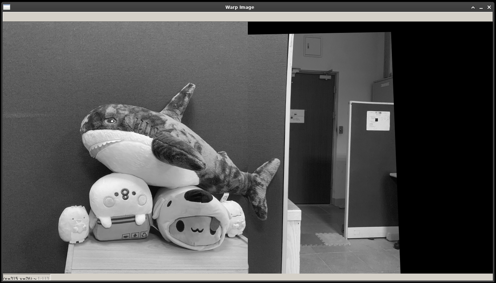

# sift-opencv

A simple example of [sift](https://en.wikipedia.org/wiki/Scale-invariant_feature_transform) with OpenCV.

To execute: `python main.py`

## Screenshots

- Draw keypoints:  
  
- Match keypoints:  
  
- Warp images:
  
